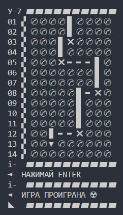
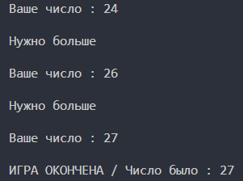
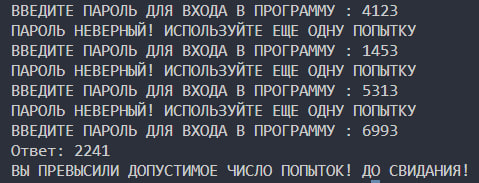

# Python-Games
my python games

# MIDDLEtake [ Game of the Year Edition ]

<a href="https://github.com/k11sann/Python-Games/tree/main/MiddleTAKE" class="button-class">[ PLAY ]</a>

# HOTcold

<a href="https://github.com/k11sann/Python-Games/tree/main/HOTcold" class="button-class">[ PLAY ]</a>

# RANDOMpassword

<a href="https://github.com/k11sann/Python-Games/tree/main/RANDOMpassword" class="button-class">[ PLAY ]</a>

